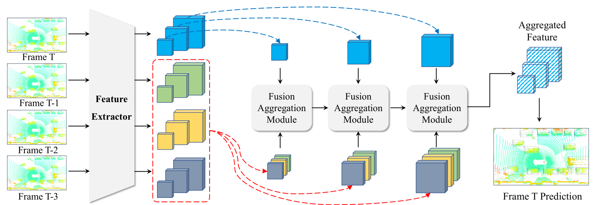
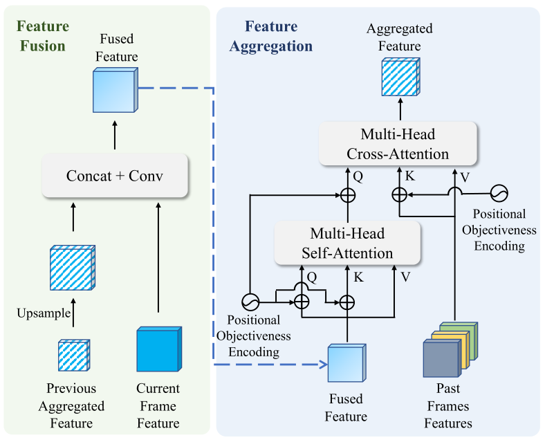

# Doc: TransPillars

## PointPillars

本文使用 PointPillars 作为基本模型，PointPillars 与其他基于体素的模型不同，仅在 x-y 平面以固定大小将点云进行离散化，以此方法生成柱体代替立方体体素。每个体素内的点用来生成特征向量，然后将获得的柱状特征散射回它们在场景中的相应位置以形成伪图像表示。然后伪图像特征经过图像金字塔处理，最后下采样的特征会被反卷积上采样，基于连接后的特征，使用检测头生成最终的检测结果。

在特征提取部分，给定一个点云输入序列 ，一个公用的特征提取器用来提取多尺度特征 。后续的特征聚合模块会聚合过往帧的有用信息来丰富当前帧的特征表示。

## TransPillars

为了实现体素级别的的聚合，面临着两个挑战。第一个是由注意力机制和全局匹配导致的高额的计算开销以及内存占用，为了缓解这个问题本文采用了最近提出的“可变形注意力”（deformable attention）的一个变体。第二个挑战是捕捉快速移动物体的运动以建立跨帧对应关系，由于小体素尺寸带来的大搜索空间，很难直接在精细特征上实现。为了解决这个问题，本文利用基本模型生成的多尺度特征设计了一种新颖的从粗到细的聚合策略。 具体来说，本文采用基于 transformer 的融合聚合模块（Fusion Aggregation Module）从粗略的特征图开始执行特征融合和特征聚合。然后将输出的聚合特征与下一个尺度级别的特征图融合以进行后续聚合。最后所有 FAM 的输出会像 PointPillars 中一样组合到一起来生成最终的预测。

## Fusion Aggregation Module

FAM包括特征融合和特征聚合模块，特征融合操作可以将前一个 FAM 的聚合特征  和当前帧的特征  当做输入，其中 i 代表尺度级别。之前聚合的特征  经过反卷积层上采样来匹配当前尺度并与当前帧特征  连接，然后再经过一个卷积层得到融合结果。

,%20%5Cmathbf%7BF%7D_%7BT%7D%5E%7Bi%7D%5Cright%5D%5Cright))

在特征聚合部分，融合后的特征  与过往帧的特征信息  聚合。融合后的特征首先经过多头自注意力模块来收集帧内特征，然后输出特征作为后续 cross-attention 的 query ，过往帧的特征在连接之后作为 key 与 value 。特征聚合操作可以总结为：

,%5Cleft%5B%5Cmathbf%7BF%7D_%7BT-1%7D%5E%7Bi%7D,%20%5Cldots,%20%5Cmathbf%7BF%7D_%7BT-N&plus;1%7D%5E%7Bi%7D%5Cright%5D%5Cright))

### Positional Objectiveness Encoding
除了 “Attention is all you need” 中介绍的使用正弦函数生成的常规位置编码之外，本文还结合了一个额外的客观性编码来促进特征聚合过程。 具体来说，从基础模型中获得每一帧的分类预测，并使用卷积层将其编码为与特征图相同的维度。在多类预测的情况下选择最高分。形式上，客观性编码由下式得到：

%5Cright))

其中， 代表类别数， 代表分类预测，) 代表 sigmoid 函数。然后将客观性编码与位置编码相加，形成位置客观性编码。